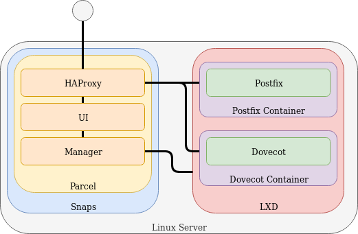

# Parcel

## About this snap

This snap will setup all you need to run a e-mail server of your own. This
snap will provision several LXD containers containing all software and
configuration.

## Requirements

You need LXD, installed localy with the lxd snap (`snap install lxd`), or
use the remote interface to connect to an existing remote (or local) LXD install.

## Simplified overview

The picture below is a simplified overview of a Parcel install. HAProxy is a
reverse proxy that routes traffic, it's used to send traffic back and forth
between different compontents. The acual mailserver software are running inside
LXD containers, in this example all on the same server. Parcel also has a remote
option if you like to connect to a existing remote LXD install.

## History

A few years back I moved away from Gmail to my self hosted solution and
I have been happy with the result. This snap is the second iteration of
that install. This install will probably be different compared to the
original one, but it is still based around my needs and what I think
a mail server should contain.
